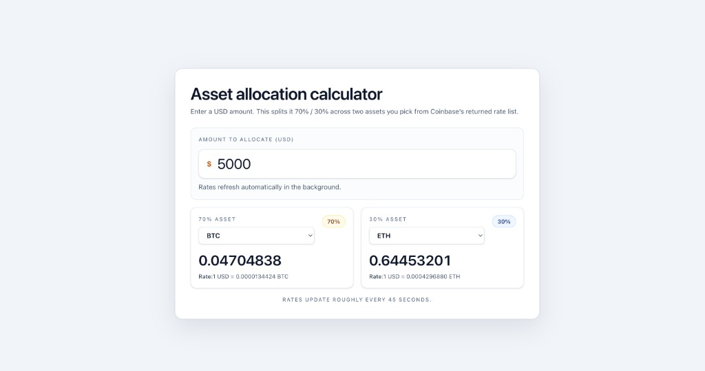

# cb-live-rates (asset allocation calculator)

> **💬 Thoughts & Thank you note :)**
>
> Hi — I’m Abdou.
>
> First off, thank you for your time! This was a really fun exercise, especially since Vue is new to me. A big part of my upfront approach was getting comfortable with Vue’s mental model and mapping it to how I typically build things in React, which is my strongest framework.
>
> From there, I focused on keeping the architecture simple and readable by separating API logic into a composable, parsing and formatting into utilities, and keeping the main component mostly declarative using computed state.
>
> There are definitely areas I could continue to refine. For example:
>
> - extracting some of the larger logic into smaller helpers
> - or tightening a few patterns
>
> But I made a conscious tradeoff to prioritize clarity and velocity given the scope of the exercise.
>
> Thanks again for the eyes and I look forward to any possible feedback!

## What this is

This is an **asset allocation calculator** with a very specific job:

- You enter an amount in **USD**
- You pick **two different crypto tickers** from the list Coinbase returns for USD exchange rates
- The app allocates **70% of the USD** to the first ticker and **30%** to the second
- It converts those USD portions into crypto amounts using Coinbase’s **“units of asset per 1 USD”** values from the exchange-rates response




## How it works (the mental model)

- **Rates source**: Coinbase `GET /v2/exchange-rates?currency=USD`
- **What the numbers mean**: for a ticker like BTC, the rate is effectively “how much BTC you get per 1 USD” (as returned by Coinbase’s payload for USD as the base currency).
- **Guards**:
  - If you pick the **same ticker twice**, the UI warns you and the calculator won’t run until you pick two distinct tickers.
  - If rates fail transiently, the app tries to keep the last good snapshot so the UI doesn’t “blink” empty.
- **Styling**: Tailwind CSS for quick iteration and clean, readable UI classes (wired via the Vite plugin in `vite.config.js`, with Tailwind imported from `src/style.css`).

## Local development

### Prereqs

- **Node.js (v23 recommended)**

### Install

```bash
cd <project-root>
npm install
```

### Run the dev server

```bash
npm run dev
```

Then open the URL Vite prints (usually `http://localhost:5173`).

## Project map (where to look)

- `src/App.vue`: the “product rules” layer (USD input, 70/30 split, selection state, what “can calculate” means)
- `src/composables/useExchangeRates.js`: fetching + polling + keeping `usdRates` in a predictable shape
- `src/utils/numberUtils.js`: forgiving USD parsing + formatting helpers
- `src/utils/usdRateTickerOptions.js`: turns the Coinbase map into stable dropdown options
- `src/components/MajorAllocationCard.vue`: re-usable compononent “card” UI for each allocation side

## Notes / caveats (worth saying out loud in a panel)

- **Public API + browser fetch**: this is fine for a demo, but a production app would usually proxy our own backend for reliability, possible caching, attribution, and clearer error handling.
- **Ticker lists can be huge**: the UI is a plain `<select>` right now. That’s simple, but for “real product UX”, the next step would be a search filter. At first, I was going to filter for only majors, but that's not ideal for a production app.


